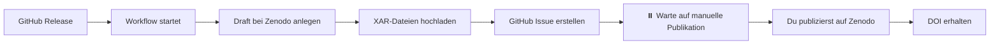

# Zenodo Integration Setup

Diese Anleitung erklärt, wie die Zenodo-Integration für semi-automatische Archivierung von Releases eingerichtet wird.

## 🎯 Ziel

- Bei jedem GitHub Release wird automatisch ein **Draft** bei Zenodo angelegt
- Du behältst volle Kontrolle und musst jeden Release **manuell** auf Zenodo publizieren
- Nach Publikation erhältst du eine DOI für langfristige Zitierbarkeit

## 📋 Voraussetzungen

### 1. Zenodo Account erstellen

1. Gehe zu [Zenodo](https://zenodo.org/)
2. Wähle **"Sign up with GitHub"** für einfache Integration
3. Bestätige deine E-Mail-Adresse

### 2. Zenodo Access Token generieren

1. Einloggen auf Zenodo
2. Gehe zu [Applications → Personal access tokens](https://zenodo.org/account/settings/applications/tokens/new/)
3. Erstelle neues Token:
   - **Name:** `GitHub Actions - portal-app`
   - **Scopes:**
     - ✅ `deposit:actions` (Upload und Publish)
     - ✅ `deposit:write` (Metadaten bearbeiten)
4. Token kopieren (wird nur einmal angezeigt!)

### 3. GitHub Secret erstellen

1. Gehe zu GitHub: `Settings` → `Secrets and variables` → `Actions`
2. Klicke auf **"New repository secret"**
3. Name: `ZENODO_ACCESS_TOKEN`
4. Value: Dein Zenodo Access Token einfügen
5. Klicke **"Add secret"**

## 🔄 Workflow-Ablauf

### Bei jedem GitHub Release:



### Automatisch:
1. ✅ Workflow erkennt neuen Release
2. ✅ Erstellt Draft auf Zenodo mit Metadaten aus CITATION.cff
3. ✅ Lädt alle XAR-Dateien hoch
4. ✅ Erstellt GitHub Issue mit Publikations-Link
5. ⏸️ **STOPPT HIER** - Keine automatische Publikation!

### Manuell (du):
6. 👤 Überprüfe Draft auf Zenodo
7. 👤 Publiziere oder verwerfe Draft
8. 👤 Trage DOI in CITATION.cff ein
9. 👤 Schließe GitHub Issue

## 🚀 Release-Prozess

### 1. GitHub Release erstellen

```bash
# Tag erstellen
git tag -a v1.2.0 -m "Release v1.2.0"
git push origin v1.2.0

# Oder über GitHub UI: Releases → Draft a new release
```

### 2. Workflow läuft automatisch

Du erhältst:
- ✅ GitHub Issue: "📦 Zenodo Draft bereit zur Publikation: v1.2.0"
- ✅ Kommentar am Release mit Anleitung

### 3. Zenodo Draft überprüfen

Gehe zu: `https://zenodo.org/deposit/DEPOSITION_ID`

**Überprüfe:**
- [ ] Titel und Version korrekt?
- [ ] XAR-Dateien hochgeladen?
- [ ] Metadaten vollständig?
- [ ] Lizenz korrekt (CC-BY-4.0)?
- [ ] Keywords passend?

### 4. OPTION A: Publizieren ✅

**Via Web-Interface:**
1. Auf Zenodo-Deposition-Seite → **"Publish"** klicken
2. DOI wird generiert (z.B. `10.5281/zenodo.1234567`)

**Via API:**
```bash
curl -X POST \
  -H "Authorization: Bearer $ZENODO_ACCESS_TOKEN" \
  https://zenodo.org/api/deposit/depositions/DEPOSITION_ID/actions/publish
```

### 5. OPTION B: Draft verwerfen ❌

Falls der Draft nicht publiziert werden soll:

```bash
curl -X DELETE \
  -H "Authorization: Bearer $ZENODO_ACCESS_TOKEN" \
  https://zenodo.org/api/deposit/depositions/DEPOSITION_ID
```

### 6. Nach Publikation: DOI eintragen

#### A) CITATION.cff aktualisieren

```yaml
# CITATION.cff
cff-version: 1.2.0
title: baudiApp
# ... andere Felder ...
doi: 10.5281/zenodo.1234567  # <-- NEU
version: '1.2.0'
```

#### B) README.md Badge hinzufügen

```markdown
[](https://doi.org/10.5281/zenodo.1234567)
```

#### C) GitHub Issue schließen

Kommentiere das Issue und schließe es:
```
✅ Publiziert auf Zenodo
DOI: 10.5281/zenodo.1234567
```

## 🔧 Workflow anpassen

### Metadaten ändern

Bearbeite `.github/workflows/zenodo-draft.yml`:

```yaml
"metadata": {
  "title": "...",
  "creators": [
    {
      "name": "Dein Name",
      "affiliation": "Deine Institution",
      "orcid": "0000-0000-0000-0000"  # Optional
    }
  ],
  "keywords": ["keyword1", "keyword2"],
  # ...
}
```

### Weitere Dateien hochladen

Workflow lädt automatisch alle `.xar` Dateien hoch. Für andere Dateitypen:

```yaml
- name: Upload additional files
  run: |
    curl -X PUT \
      -H "Authorization: Bearer ${{ secrets.ZENODO_ACCESS_TOKEN }}" \
      --data-binary @"README.pdf" \
      "${{ steps.zenodo.outputs.bucket_url }}/README.pdf"
```

## 🎨 Zenodo Communities (Optional)

Füge dein Repository zu Zenodo Communities hinzu:

1. Nach Publikation: Gehe zu deiner Zenodo-Veröffentlichung
2. Klicke **"Communities"** → **"Submit to community"**
3. Suche z.B.:
   - `digital-humanities`
   - `research-software`
   - `exist-db`

## ❓ Troubleshooting

### Problem: GitHub Secret nicht gefunden

**Fehler:** `secrets.ZENODO_ACCESS_TOKEN` ist leer

**Lösung:**
- Überprüfe unter `Settings` → `Secrets and variables` → `Actions`
- Secret muss genau `ZENODO_ACCESS_TOKEN` heißen
- Secret ist nur für den Repository-Owner sichtbar

### Problem: Zenodo API gibt 401 Unauthorized

**Fehler:** `Unauthorized` bei API-Aufruf

**Lösung:**
- Token abgelaufen? Generiere neues Token auf Zenodo
- Scopes falsch? Token braucht `deposit:actions` und `deposit:write`
- Token in GitHub Secret aktualisieren

### Problem: Upload schlägt fehl

**Fehler:** Datei kann nicht hochgeladen werden

**Lösung:**
- Ist die Datei zu groß? (max. 50 GB pro Datei)
- Bucket URL korrekt? Prüfe Workflow-Log
- Zenodo Down? Checke [Zenodo Status](https://www.zenodo.org/)

### Problem: Workflow läuft nicht

**Fehler:** Workflow startet nicht bei Release

**Lösung:**
- Workflow-Datei committed und gepusht?
- Workflow muss in `main` oder `develop` Branch sein
- GitHub Actions aktiviert? `Settings` → `Actions` → `General`

## 📚 Weitere Ressourcen

- [Zenodo API Documentation](https://developers.zenodo.org/)
- [GitHub Actions: Publishing to Zenodo](https://docs.github.com/en/repositories/archiving-a-github-repository)
- [FAIR Software Recommendations](https://fair-software.eu/)
- [Citation File Format](https://citation-file-format.github.io/)

## 🔗 Wichtige Links

- **Zenodo:** https://zenodo.org/
- **Deine Uploads:** https://zenodo.org/deposit
- **API Token:** https://zenodo.org/account/settings/applications/tokens/new/
- **GitHub Secrets:** `https://github.com/Baumann-Digital/portal-app/settings/secrets/actions`

---

## ✅ Setup-Checkliste

- [ ] Zenodo Account erstellt
- [ ] Mit GitHub verbunden
- [ ] Access Token generiert
- [ ] Token als `ZENODO_ACCESS_TOKEN` in GitHub Secrets gespeichert
- [ ] Workflow-Datei `.github/workflows/zenodo-draft.yml` committed
- [ ] Test-Release erstellen und Workflow testen
- [ ] Nach erstem erfolgreichen Release: DOI in CITATION.cff eintragen
- [ ] DOI-Badge in README.md einfügen
- [ ] FAIR-Software Badge auf 5/5 aktualisieren 🎉
